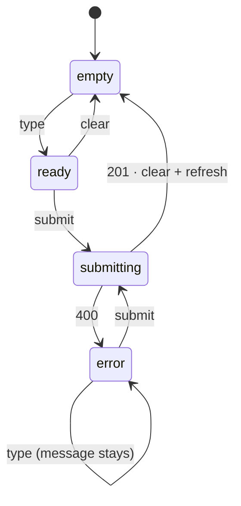

# Week 5 Homework — One Component, Drawn and Built

*Assigned the week-5 session · one stateful component from your product +
its state diagram · a gated PR, reviewed by a teammate, merged before the
week-6 session · the worked example is `TodoForm` on the starter's
`example/todos` branch (the "Draw the states before you write them" slide)*

# tl;dr

Pick one component in your product that holds state and talks to your
API. The create form you started in project time is the obvious one. Draw
its states and the events that move between them, then make the code
match the drawing. The PR carries both, and your reviewer checks one
against the other by clicking every arrow.

## A subway map, not a street map

A subway map lies about almost everything. The distances are wrong, the
curves are fake, whole neighborhoods are missing. And it's the most useful
map in the city, because it tells the truth about the one thing you need:
which stops exist, and how you get from one to the next.

A state diagram is a subway map of a component. `TodoForm`'s `title` can
be any string ever typed, which is an infinite street map nobody could
draw. The diagram throws all of that away and keeps four stops: *empty*,
*ready*, *submitting*, *error*. Each stop is a thing the user can see.
Each line between stops is an event: a keystroke, a submit, a 201, a 400.
That's the whole component, with the code taken out.

It's the same move as week 3, when you read the migration SQL to see your
schema in the language the database speaks. The diagram is your component
in the language a *user* speaks. If the diagram and the code disagree, one
of them is wrong, and now you can see which.

## Now yours

**1 · Pick the component.** It has to hold state (`useState`) and it has
to talk to your API. The create form from project time is the default,
posting to the endpoint you built last week. A `page.tsx` doesn't count:
it's a Server Component, so there's nothing in it to remember. A
component that only displays its props doesn't count either. No state,
no map.

**2 · Draw it first.** Boxes are states that change what's on screen, and
each box says what the user sees in it. Arrows are events, labeled.
Paper and a phone photo is fine. Better, write it in Mermaid, because
GitHub draws it for you right in the PR:

````markdown

````

That's `TodoForm`, exactly as the slide drew it. Yours will have
different stops. Fewer than you'd guess, usually.

**3 · Look for the stops that shouldn't exist.** Count your `useState`s.
Three booleans can be in eight combinations. How many of those are on
your map? `TodoForm` could in principle be `busy` *and* showing an
`error` at the same time. The code prevents it with `setError(null)` at
the top of `submit()`, which works, but only because someone remembered.
If you find one of these in your own component, you have two honest
fixes: guard it, or collapse the booleans into a single status:

```ts
const [status, setStatus] = useState<"idle" | "submitting" | "error">("idle");
```

Notice what that buys you. One variable can only be one thing, so the
impossible combination stops being something you have to remember and
becomes something you can't write. Either fix is fine. Say which one you
picked in the PR.

**4 · Build it to match.** `"use client"` goes on this component, not on
the page. The page stays a Server Component and renders it. Errors show
whatever your API's `{ error: { message } }` said, because that's why we
standardized it. Anything you can compute from state, compute. Don't
store it. The button's `disabled` is a good first candidate.

**5 · Ride every line.** With `pnpm dev` running, make every arrow on
your diagram happen at least once in the browser. The happy path is
easy. For the 400, send something your Zod schema rejects. If your form
blocks it client-side, paste 201 characters or whatever your `max` is.
Then find the arrow that's missing. Here's how to find the todo app's:
stop the dev server, type a todo, click Add.

The button says "Adding…" forever. (In dev, Next.js also pops its error overlay. Close it and look at the button.) `fetch` threw, nothing caught it, and
`setBusy(false)` never ran. There's no arrow out of *submitting* for
"the network died," so the component is stuck on a stop with no exit.
The diagram didn't show it because nobody drew it, and the code didn't
show it because code never shows you what's missing. Clicking did. Check
whether yours has the same hole. If it does, draw the arrow, then write
the `try` / `catch` that makes it true.

**6 · The PR.** It contains the component, and it contains the diagram in
the description as Mermaid. Also copy the diagram into last week's feature
spec (`docs/specs/<domain>/<thing>.md`) under a `## UI states` heading,
next to the endpoint table, so the screen and the API it calls are
documented side by side. Under the diagram, list the arrows you rode and
how you triggered each one. That's the "run it" step, done for your
reviewer in advance.

## Reviewing one of these

Same four moves: pull it, run it, read it, ask one real question. For
this PR, "run it" means riding the diagram yourself, not trusting the
list. And the best real question is almost always the same one: *is
there a stop that isn't on the map?* Kill the server. Double-click the
button. Hit back mid-submit. If you find a new one, that's a great review
comment, and it's a better component by next session.

## Done means

The PR is merged into `main` with a teammate's review, and the diagram
renders on GitHub. Every arrow on it has been ridden by two people, the
author and the reviewer. Either there's no stuck stop, or there's an
arrow and a `catch` for it.

## What we didn't cover

`useReducer`, which is the next step after collapsing booleans into a
status. XState, which makes the diagram literally *be* the code.

`useRef`, which is the one kind of memory that *isn't* on your map. A ref
is a box that survives renders, and changing what's in it doesn't cause
one. `TodoAttachment` uses one to reach the real `<input type="file">`
and clear it after an upload. Anything the user can see belongs in
state. Refs are for the handles and bookkeeping behind the screen.

`useMemo`, which caches a derived value between renders. You derived
`open` from the list on every render, and that was correct. `useMemo` is
for when that math gets expensive enough to measure, and it usually
isn't. We measure in week 12. Until then, derive first and cache
never.

Optimistic updates, where the screen moves before the server answers.
That last one is week 6, and it's where a good map starts to really pay
off. The watch-ahead is the async set. Your form's `fetch` is the reason
it's on the list.

So, which stop on your map surprised you? Put it in the PR description.
Your reviewer will want to ride that one first. 🔰
